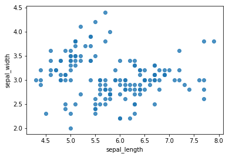
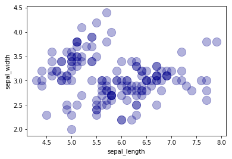
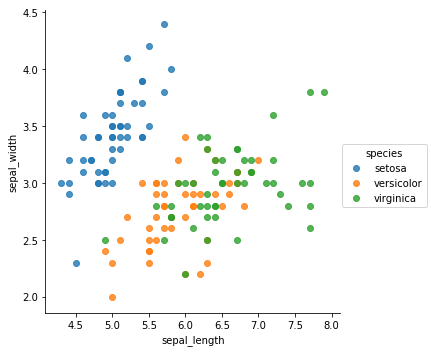

## Statistical visualizations with `seaborn`

Scatterplots, as we briefly seen in our introductory lessons and labs, display the values of 2 sets of data on 2 dimensions. Each dot represents an observation. The position on the X (horizontal) and Y (vertical) axis represents the values of the 2  variables. These are useful to study the relationship between different variables. It is common to provide even more information using colors or shapes (to show groups, or a third variable). 


The sample scatter plot above shows a relationship between Income and health index for a given sample of data. We can see an overall trend in the data depicting that increase in the income may have some effect on the health of individuals. 

### Creating Scatter Plots in SeaBorn
As seen earlier, scatter plots are simple to draw in ,atplotlib using the `.scatter()` method. In this lesson, we shall use a different plotting library avaialble in Python calles `seaborn`. Seaborn provides a high-level interface for drawing attractive and informative statistical graphics. Here is some of the functionality that seaborn offers out of the box:

* An API for examining relationships between multiple variables
* Support for using categorical variables and their aggregate statistics
* Visualizing univariate or bivariate distributions 
* High-level abstractions for structuring multi-plot grids
* Concise control over matplotlib figure styling with several built-in themes
* Tools for choosing color palettes that faithfully reveal patterns in your data

Let's focus at scatter plots for now. In order to use seaborn, we first need to import it alongside matplotlib as shown below:


```python
import matplotlib.pyplot as plt
import seaborn as sns
```

Seaborn comes packaged with a number of datasets for pratice and exploration. We shall import the famous **iris dataset** for drawing our scatter plots in the lesson. 


```python
# Load the iris dataset into a pandas dataframe
iris_data = sns.load_dataset('iris')
# View the head of dataset
iris_data.head()
```


<div>
<style scoped>
    .dataframe tbody tr th:only-of-type {
        vertical-align: middle;
    }

    .dataframe tbody tr th {
        vertical-align: top;
    }

    .dataframe thead th {
        text-align: right;
    }
</style>
<table border="1" class="dataframe">
  <thead>
    <tr style="text-align: right;">
      <th></th>
      <th>sepal_length</th>
      <th>sepal_width</th>
      <th>petal_length</th>
      <th>petal_width</th>
      <th>species</th>
    </tr>
  </thead>
  <tbody>
    <tr>
      <th>0</th>
      <td>5.1</td>
      <td>3.5</td>
      <td>1.4</td>
      <td>0.2</td>
      <td>setosa</td>
    </tr>
    <tr>
      <th>1</th>
      <td>4.9</td>
      <td>3.0</td>
      <td>1.4</td>
      <td>0.2</td>
      <td>setosa</td>
    </tr>
    <tr>
      <th>2</th>
      <td>4.7</td>
      <td>3.2</td>
      <td>1.3</td>
      <td>0.2</td>
      <td>setosa</td>
    </tr>
    <tr>
      <th>3</th>
      <td>4.6</td>
      <td>3.1</td>
      <td>1.5</td>
      <td>0.2</td>
      <td>setosa</td>
    </tr>
    <tr>
      <th>4</th>
      <td>5.0</td>
      <td>3.6</td>
      <td>1.4</td>
      <td>0.2</td>
      <td>setosa</td>
    </tr>
  </tbody>
</table>
</div>


A detailed list of all the datasets included with seaborn is available at [this github repository](https://github.com/mwaskom/seaborn-data). 

With seaborn, scatterplots are made using the `regplot()` function (compareable to `.scatter()` in matplotlib). Here is an example showing `regplot()` in action with the most basic settings. This function needs 2 lists for the positions of points on the X and Y axis. By default it also draws a linear regression fit which we shall remove with `fit_reg=False`.

Let's draw a scatter plot between the sepal length and sepal width using `regplot`. 


```python
# Use seaborn to draw a scatter plot between speal length and sepal width columns from the dataset
sns.regplot(x=iris_data["sepal_length"], y=iris_data["sepal_width"], fit_reg=False);
```





Seaborn offers custom coloring and further customization of the scatter plots with shapes. 
the `scatter_kws` can be used to specify the size , color and transparency of markers as shown the example below:


```python
# More marker customization:
sns.regplot(x=iris_data["sepal_length"], 
            y=iris_data["sepal_width"], 
            fit_reg=False, 
            scatter_kws={"color":"darkblue",
                         "alpha":0.3,
                         "s":200} )
plt.show()

```





Once you understood how to make a basic scatterplot with seaborn and how to custom shapes and color, you probably want the color corresponds to a categorical variable (a group). This is possible using the hue argument: it’s here that you must specify the column to use to map the color.


```python
# Use the 'hue' argument to provide a factor variable
sns.lmplot(x="sepal_length", 
           y="sepal_width", 
           data=iris_data, 
           fit_reg=False, 
           hue='species', 
           legend=True);
plt.show()
```




